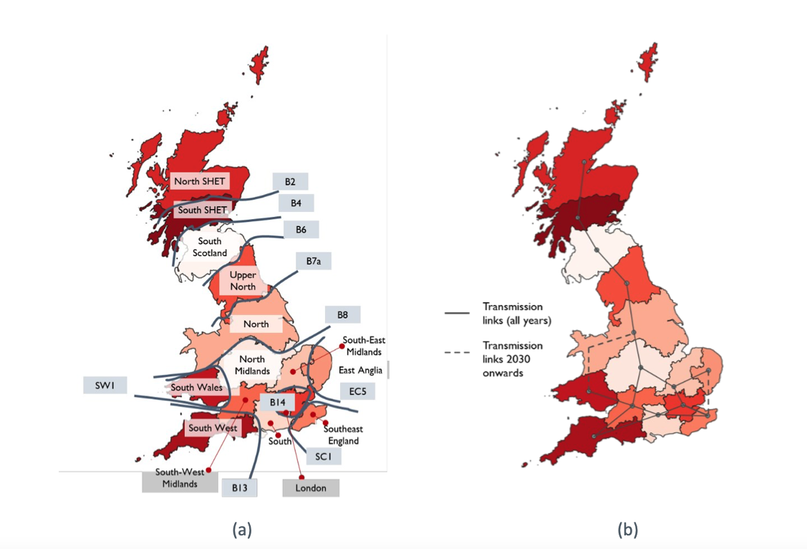

# **Dispatch Model - Public**
This is the *public version* of the read-me/guide on the work I completed for Regen developing an in-house GB Power Dispatch Model. The code and detailed results of this project are housed elsewhere in a private repo.

***
***
***
## Regen's Dispatch Model: Goals

The purpose of the project is to model the operation of the GB electricity network. In particular **the model simulates the dispatch of power generation and energy storage and flexibility technologies in order to meet power demand across a given year at an hourly resolution.**

The aims of such a model are to better understand the state of the grid today and the importance and feasibility of the various infrastructure expansions proposed for the electricity network in the coming decade. These questions have become even more pressing than usual in the run up to 2030 with the Labour governments announcement of a **Clean Power Plan by 2030** which aims for GB, by 2030, to be:

1. **a net exporter of energy,**
2. **and for fossil fuels i.e. natural gas to form <5% of the generation mix.**

Only a diect simulation of the electricity network can begin to explore the interplay between these changes, the details/forecasts of which the government, via **NESO**, has outlined in its annual **Future Energy Scenarios (FES) reports** and more recently in its **Clean Power 2030 (CP30) action plan**. It is from these datasets that the Regen's model imports the current (2023-) and planned installed capacities of each grid technology. The model however is flexible and may be trained on data from any other source.

Some rough questions the model aims to explore (*this list is ongoing and can be updated when new use cases for the model arise*):

1. **How does increasing installed capacity of renewable technologies affect the generation mix?**
2. **In particular how does gas generation change across the year?**
3. **With increasing use of renewables, in particular on/offshore wind, how does the curtailment and constraint of these technologies change?**
4. **What role can storage technologies, e.g. batteries, pumped hydro, and flexibility services, e.g. demand side response (dsr) and hydrogen electrolysis, play in ensuring supply meets demand? and the minimising of constraint costs?**
5. **How will GB transition from a net importer to a net exporter of energy with the use of interconnectors?**
6. **How will the above require and in turn be affected by planned expansions of the capacity of the grid transmission network?**

***
***
***
## Regen's Dispatch Model: Description

***
### Overview

The model is built in Python with inputs and outputs read and written to excel sheets. The model simulates the dispatch and flow of power over a network using **Python's Power Systems Analysis** package **PyPSA**. Some details of this package are explained below and references to further reading are supplied. A simulation is undertaken for a given year at an hourly resolution. **The baseline year for the model is the year 2023.** This is also known as the 'weather year' since it is 2023 weather (and market) behaviour which ultimately determined the 2023 demand, price and capacity factor profiles used in the model. These profiles, when necessary , are resclaed to match the average statistics of the year actually modelled.

The **dispatch of technologies is done in according to their marginal costs** which have been specified *not* to reflect actual costs but rather to simply ensure the proper behaviour of these technologies and their **dispatch in the expected merit order.**

The model optimises the dispatch of technologies by seeking to minimise the total system cost. Broadly speaking this is the sum, over all time periods $t$ and over all technologies $i$ at each node $k$ on the network, of the cost of each generator $C_{t, k, i}$ given by the power dispatched $p_{t, k, i}$ multiplied by the marginal cost of that power $c_{t, k, i}$. (PyPSA is a very flexible package, for example we have used time-varying price dependent costs associated with charging and discharge of storage technologies. Further custom costs can be defined.) The optimisation is made by varying the dispatched power parameters $p_{t, k, i}$ and it the resultant set of optimised parameters that defines an instance of a trained model which can be further analysed and its performance measured.

The problem of optimised dispatch of power on a network is a constrained problem. At every node available power must meet the demand load, similarly the flow of power around the system is constrained by various physical electrical laws pertaining to voltage, current and power balances. This model and many others in the literature approximate these laws as linear constraints. The resulting problem is called the **Linear Optimal Power Flow (LOPF)** problem and is a linear optimisation problem. In this project this problem is solved using the linear solver [HiGHS](https://highs.dev).

**In fact, two versions of the optimisation are carried out for any given model.** The **first is the one described above, a pure dispatch problem**, where power is dispatched to meet demand on a constrained network. We also use PyPSA to carry out a **second alternative optimisation where both the power dispatch and the capacity of the lines in the model are optimised**. This typically leads to lines (aka boundaries) having their capacity extended in order to avoid constraints on the network. (A side effect is that the model will also reccomend reducing capacity for lines which are under utilised, this has no effect on power flow and we ignore this side effect.) The results of the two optimisations may be compared to judge the effect of constraints versus no constraints.

In our model the extension of the lines is done at no cost to the system so is undertaken solely in order to maximise the use of power. An interesting extension of our model might consider optimising while introducing a capital cost, incurred when extending the line capacity, and weigh this against some measure of the cost of constriants to the system.

More info on: [Power Flow in PyPSA](https://pypsa.readthedocs.io/en/latest/user-guide/power-flow.html) and [System Optimisation in PyPSA](https://pypsa.readthedocs.io/en/latest/user-guide/optimal-power-flow.html).

***
### Network Architecture

The **model approximates the GB grid into 14 zones** each represented by a single node/bus and with **18 boundaries** each represented by a single transmission line. The simplified electicity network looks like this:

The zonal splitting and aggregation of the GB network is borrowed from the [Strathclyde Report](https://strathprints.strath.ac.uk/91062/1/Full-Report-Gill-and-Bell-2024-How-far-does-the-power-go.pdf) from which this figure has been copied with permission. ***We thank Regen associate Dr Simon Gill and his collaborators for the help provided in developing this model.*** The splitting into zones is an important step in allowing a model to be trained and analysed quickly while maintaining the key features of the network. To this end the particular boundaries of the zones align with key transmission boundaries on the network. In any given year, these are often bottlenecks to the flow of power and lead to generation, particularly renewable generation, being constrained at a cost to the system.

We also model outages of the transmission lines. This is done by randomly applying outages to the boundaries at a certain rate (as a fraction of the year) and with a certain reduction effect (as a fraction of the boundaries capacity).

In order to capture the diversified nature of the GB electricity system and evaluate the questions above the model incorporates the following technologies.

***
### Technologies

Below are the technologies modelled, listed in a rough merit order. Each technology is defined at each node of the network (allowing for some nodes to have zero installed capacity of that technology). There is no reason why one cannot define multiple examples of the same technology at each node, with different hyperparameters e.g. costs, this has *not* been done in this project in order to keep things simple. So an example technology name is 'East Anglia_wind' or 'South West_biomass'.

#### 1. Nuclear

   Nuclear is modelled as an entirely non-dispatchable generator operating at a fixed customiseable baseload and with random scheduled outages at some rate (as fraction of the year) and during which power drops further to a fraction of the baseload.

#### 2. Renewable technologies: solar (PV), onshore wind, offshore wind and 'other renewables' (marine, run-of-river hydro, geothermal)

   These technologies are variable generators whose generation at any given time is limited by their weather and tech dependent capacity factor. The timeseries for these factors is generated by the renewables.ninja API. At any given hour, these technologies may be 'dispatched' up to this capacity factor with any potential power generation not used being 'wasted/turned down'. This occurs due to a combination of local and system-wide factors in tandem. At the base level it is due to a lack of demand matching this generation, either locally e.g. due to *grid constraints* (for which the generator will be compensated) or at the system-wide level because the total GB renewable potential power exceeds total GB demand (termed *curtailment*, which generators are not compensated for). Alleviating factors which may help absorb excess generation are: the availability of storage, interconnector export capability, upward demand side repsonse (DSR), dispatchable electrolysis loads.

#### 3. Hydrogen Electrolysis Load

   This is a dispatchable load (modelled as a generator with negative power) which when dispatch absorbs power on the network up to its installed capacity. It is modelled with a negative marginal cost so that its dispatch is at a net gain to the system reflecting its utility. This utility may be custoimised but is set to be greater than corresponding cost of renewables, such that electrolysis absorbs excess renewable generation hence avoiding curtailment, but less than dispatchable fuel generators and other technologies. I.e. we encourage elctrolysis of green hydrogen over blue hydrogen.

#### 4. Batteries, Pumped Hydro, DSR

   These are storage (batteries and pumped hydro) and flexibility technologies (DSR). Both are modelled in the same manner as an energy 'store' component with a particular *duration* and a pair of power 'link' components allowing charging and discharging up to specified power capacities. This 'link-store' vernacular comes from the Python PyPSA package, further explained below. Pumped hydro being a long-duration energy storage (LDES) technology has a larger duration parameter. All the above technologies are constrained to charge/discharge cyclically over the year i.e. no net charging at the years end.

   The modelling of DSR as a 'link-store' component is an approximation of the diverse behaviour of technologies that lie under the umbrella of DSR. Using a 'link-store' component is a quite flexible model of DSR allowing for: the specification of a 'duration' (after which the capacity to absorb or increase demand is exhausted) and independent power capacities for DSR in either direction, demand increase (charging from grid) or demand decrease (discharging to grid).

   The 'store' component of these technologies has a marginal cost of discharging and an identical marginal utility (negative cost) to encourage charging (rather than say curtailing excess power). This cost/utility is time varying and follows a standardised (mean 0, variance 1) 'price measure' derived from the residual power demand i.e. demand after subtracting the power potential of renewables and nuclear. This is meant to model the sensitivity of the operation of these storage technologies to signals from wholesale price data (assumed to roughly follow residual demand i.e. power scarcity).

   The 'link' components connecting these technologies to the grid have a fixed positive marginal cost of operation regardless of direction of power flow. This is chosen to roughly set their place here in the merit order.

#### 5. Low Carbon Fuels: biomass, biowaste, gas CCS, hydrogen

   These are dispatchable low carbon fuel generators are dispatched to meet excess residual demand after renewable technologies. These fuel generators may dispatch up to their rated installed capacity (i.e. maximum power) except when experienceing an outage which are randomly generated over the year at some rate and cause generation to drop to some fraction. Their marginal costs are set so that they regularly but not always outcompete the above storage technologies in the merit order, depending on price signals those technologies receive.

#### 6. Interconnectors

   Interconnectors allow for the import and export of power onto and off the GB grid. They are also modelled as 'link-store' components with 'links' connecting select nodes on the GB grid to 'stores' defined for each EU contry with an interconnector to GB. The EU interconnector 'stores' are special they have essentially infinite storage capacity and hence duration. This allows power to be import/export readily as long as it is within the power capacity of the interconnector 'links'. They are also not constrained to operate cyclically so they can have a net imbalance of imports vs exports over the year,

   The interconnector 'stores' are also price dependent, much like batteries, dsr etc, except they see the price *difference* between the standardised GB price measure and the standardised price of energy in the respective EU country (mean 0, variance 1).

   The 'link' components connecting interconnectors to the grid have a fixed positive marginal cost of operation regardless of direction of power flow. This is chosen to roughly set their place here in the merit order.

#### 7. Carbon intensive fossil fuels: gas, diesel, coal

   These are dispatchable carbon-emmiting fuel generators used as a last resort in this idealised model (used regularly in 2023 but forecasted to play a diminishing role in the future). As usual, the marginal costs of these generators determine how they compete in the merit order. Diesel and coal are highest on the merit order and are only used as a very last resort to meet demand. Gas, on the otherhand, is used routinely in the real world 2023 GB power system and its marginal cost in the model is chosen to reflect this. The consequence of this is that semi regularly it is in direct competition with interconnectors (depending on the price signals in GB and from EU).

***
### Trained Instances of the Model

#### 2023 Baseline Model

   The model has been trained on 2023 data as a baseline in order to check the behaviour of the model against real-world data (e.g. real world data from NESO dashboard via CP30 workbook). Key metrics which have been used to validate the model and tune hyperparameters (e.g. marginal costs, fraction and rate of outages etc.) are: generation of each technology (particularly gas, being last in the merit order), import and exports of interconnectors (which directly compete with gas), level of curtailments of renewables.

#### 2030 Forecast Model

   The model is the same instance of the model above i.e. tuned to perform well against 2023 real-world data e.g. by fixing marginal cost hyperparameters. But the inputs used in this case are now 2030 forecast data from a combination of FES24 (for zonal weightings) and CP30 workbooks (for GB wide data). This is main current (feb 25) use case of the model and is being used to evaluate the forecasts made in the CP30 and forthcoming FES25 reports. 

   For this version of the model the hyper parameters e.g. marginal costs have remained fixed to the values which we validated with the 2023 baseline.

   The performance/behaviour of the model at forecasting can be roughly gauged by comaring predictions for the key metrics described above to those made in the CP30 FF&R pathway thanks to NESO's modelling. Noting that NESO's modelling is NOT the ground truth. No tuning of model to CP30 outputs however.

#### NESO Outputs

The outputs of the above models should be compared to the NESO CP30 outputs (e.g. generation, im/exports, storage usage, curtasilemetn) summarised in 'background_references/GB_outputs_NESO.xlsx'.

***
***
***
## Useful Resources
  
***
Here is some further reading which may provide some useful background to the model described here:

1. **PyPSA documentation** has useful information on PyPSA package design, the various network components and the API full reference, along with some other uses for the package.

   [PyPSA Components](https://pypsa.readthedocs.io/en/latest/user-guide/components.html)

   [PyPSA Design](https://pypsa.readthedocs.io/en/latest/user-guide/design.html)

   [API Reference](https://pypsa.readthedocs.io/en/latest/references/api-reference.html)

   [Example Models using PyPSA](https://pypsa.readthedocs.io/en/latest/examples-models.html)

2. **Similar Models**

   [PyPSA-UK](https://github.com/ember-climate/pypsa-uk/) is an open source PyPSA-based dispatch model created by the energy think tank Ember, used at the start of the project to learn the scope of such models. The Regen model now largely surpasses this model.

   [PyPSA-GB](https://pypsa-gb.readthedocs.io/en/latest/) is another PyPSA-based dispatch model created at the University of Edinburgh. [Report here](https://www.sciencedirect.com/science/article/pii/S2211467X24000828?ref=pdf_download&fr=RR-9&rr=9104f83e3fb294a7).

3. **Strathclyde Model: A sopisticated Excel-based dispatch model**
   
   During the development of Regen's dispatch model, we liased with Regen Asssociate Dr Simon Gill who, with his collaborators at the University of Strathclyde, has developed a multiyear dispatch model in Excel and ran in-depth studies of the expansion of the GB electricity network. **We thank Simon for his advice on this project** and reccommend the [Strathclyde Report](https://strathprints.strath.ac.uk/91062/1/Full-Report-Gill-and-Bell-2024-How-far-does-the-power-go.pdf) as a great reference for how to use dispatch modelling to answer pertinent questions about the energy systems of today and tomorrow. 

4. **Power Systems Analysis** is a complex topic, but useful to understand the basics to know what PyPSA is doing in the background.

   [Power Sector Modelling (US Department of Energy)](https://www.energy.gov/sites/prod/files/2016/02/f30/EPSA_Power_Sector_Modeling_FINAL_021816_0.pdf) provides the lay of the land of what power system modelling is capable of.

   [Optimal Power Flow (pandapower)](https://pandapower.readthedocs.io/en/v1.4.2/powerflow/opf.html) sets out the mathematical formulation for an economic dispatch and power flow analysis. This is the math that PyPSA does in the background.

   
***
## Improvements and Open Questons

### Improving Regen's Dispatch Model

* Demand profiles - GB-wide demand profiles are disaggregated into regions based on the yearly total demand level in that region. This does not allow for the fact that different regions may have independently varying demand hour-by-hour. To model this one needs to find demand profiles for each GSP and then aggregate up to the demand profiles for each zone. This is a simple (possibly laborious) data collection task. Once found one can input the data into the models zonal demand profiles by altering the code in **"assemble_model_inputs.ipynb"**.

* Outages on boundaries with actual 2023 outage curves. Boundaries are an aggregation of lines so one would need to find the actual availability for the boundaries.

* Similarly outages of generators are modelled as random and occuring at some fraction. This behaviour could be refined by considering actual data on outages, both to adjust the fraction of outages and also their distribution accross the year. Or even to find actual outages that happened in 2023 for various techs and build zonal generator availability profiles.

* Heating - including heat demand and CHP generation separately to other demand and generation in the model. This would make the CHP generation more realistic as currently (Feb 25) it is rolled into total demand, its demand curves are not tailored to the specific behaviour of heating demand as relates to ambient temperaature and weather in general. Similarly, for each techonology CHP generation is combined with general power generation.

* Proper costing of all technologies while still reflecting the merit order. This will also include using the actual european price data rather than the currently used (Feb 25) standardised price level measure. One would also need GB price data (either from external sources or estimated by the model itself and calibrated). Proper costing would begin to allow one to tackle some of the open questions below.

***
### Open Questions

* **Comparison of different pathways and scenarios (study can be immediately undertaken)**

* **Amount and costs of constraints vs curtailments.**
In our model the scenario where we extend the line capacities is done at no cost to the system so is undertaken solely in order to maximise the use of power. An interesting extension of our model might consider optimising while introducing a capital cost, incurred when extending the line capacity, and weigh this against some measure of the cost of constriants to the system.

* **Multi year infrastructure investment scenarios and comparisons.** As well as look at cost of extending lines one could also look at fully costing the expansion of installed capacities over multiple years. PyPSA has functionality which allows it to optimise the installed capacities extending technologies where needed. This can be controlled by including a capital cost allow such studies to be explored.

* **Differing behaviour of the variety of DSR services.** Include different DSR services with different marginal costs, capacities and durations.

* **Revenues streams and behaviours of storage and flexibility services.** Perform a study of the various revenue streams of storage and flex serices and include these in the model (speculative).

